# Neon Zomato

Neon Zomato is a Zomato-inspired Android food delivery app built with Kotlin and Jetpack Compose. It uses a dark "Neon Noir" design language, mock food data, animated shopping flows, Room-backed cart persistence, selectable coupons, a mock payment gateway, and live order tracking with Google Maps Compose.

The project is designed for Android Studio Dolphin 2021.3.1 era tooling.

## Current Status

The app builds successfully with:

```powershell
.\gradlew.bat :app:assembleDebug
```

Verified result:

```text
BUILD SUCCESSFUL
```

Debug APK:

```text
app/build/outputs/apk/debug/app-debug.apk
```

## Top 10 UI Improvements Implemented

1. Home delivery intelligence strip: shows average ETA, live kitchens, and active deals.
2. Selectable animated filter chips: chips now maintain selected state with gradient highlighting.
3. Coupon marketplace in cart: users can tap coupon cards or enter a code manually.
4. Coupon validation feedback: invalid codes show a snackbar; valid codes animate with confetti.
5. Payment gateway page: a dedicated mock checkout screen with UPI, card, and wallet options.
6. Secure checkout header: animated lock/status panel with payable amount.
7. Payment authorization progress: animated gateway progress bar before order tracking.
8. Improved order progress bar: timeline now combines a filled progress rail and step icons.
9. More accessible Google Maps: content descriptions, state descriptions, custom zoom controls, and recenter action.
10. Better map presentation: route polyline, restaurant marker, customer marker, moving rider marker, ETA metrics, and rider actions.

## Tech Stack

| Area | Library / Tool | How It Is Used |
| --- | --- | --- |
| IDE target | Android Studio Dolphin 2021.3.1 | Project uses AGP 7.3.1 and Kotlin 1.7.20 for compatibility. |
| Language | Kotlin | All source files are Kotlin. No Java app code is written manually. |
| UI | Jetpack Compose | Every screen is implemented with composable functions. No XML layouts. |
| Theme | Material 3 + custom colors | Neon Noir colors, typography, shapes, gradients, and dark surfaces. |
| Architecture | MVVM + Clean Architecture | Data, domain, presentation, DI, and navigation layers are separated. |
| DI | Hilt | Injects repositories, Room DAO, Retrofit, database, DataStore wrapper, and ViewModels. |
| Navigation | Compose Navigation | Routes connect splash, onboarding, auth, home, detail, cart, payment, tracking, orders, offers, and profile. |
| Networking | Retrofit + OkHttp + Gson | Provided as production-ready scaffolding for remote APIs. Current data is mocked locally. |
| Images | Coil Compose | Loads Unsplash restaurant, dish, profile, and rider images. |
| Animation | Compose animation APIs | Used for shimmer, bounce, progress, badge pulse, morphing buttons, and visibility transitions. |
| Lottie | Lottie Compose | Splash and empty-state animation support. |
| Local DB | Room | Persists cart item IDs, restaurant names, and quantities. |
| Preferences | DataStore Preferences | Stores the Oled White profile theme toggle. |
| Maps | Google Maps Compose | Displays tracking map, route polyline, rider marker, and accessible controls. |
| Async | Coroutines + StateFlow | Drives ViewModel state, timers, flows, repository updates, and UI observation. |

## Setup

1. Open this folder in Android Studio Dolphin 2021.3.1 or newer.
2. Let Gradle sync.
3. Ensure `local.properties` points to your Android SDK:

```properties
sdk.dir=C\:\\Users\\hriti\\AppData\\Local\\Android\\Sdk
```

4. Run the `app` configuration on an emulator or Android device.

## Google Maps Setup

Google Maps Compose is wired in. The app builds with an empty key, but real map tiles require a valid Google Maps Android API key.

Set the key in `app/build.gradle`:

```gradle
manifestPlaceholders = [MAPS_API_KEY: "YOUR_GOOGLE_MAPS_KEY"]
```

The tracking screen now includes a visible Compose route-map layer above the GoogleMap composable. This means users can always see a route, rider, restaurant point, destination point, ETA metrics, and map controls even if real Google tiles fail because the API key is missing.

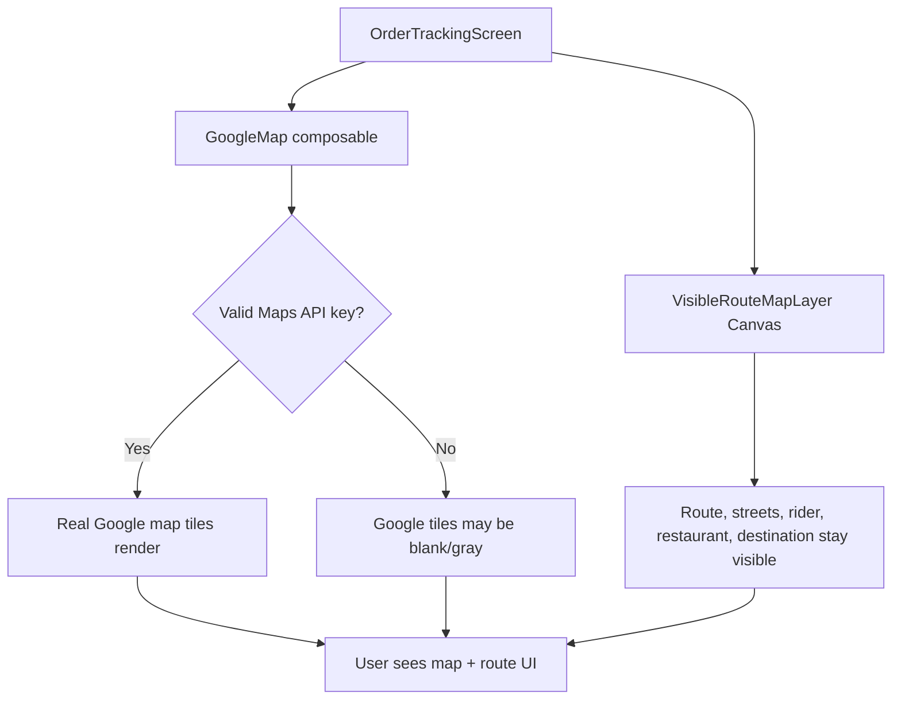

## Profile Functionality

The Profile screen is no longer decorative. The rows now open working dialogs and update local UI state:

| Profile Action | Behavior |
| --- | --- |
| Change name | Opens an edit dialog and updates the displayed profile name. |
| Addresses | Shows saved addresses and lets the user add mock addresses. |
| Payment Methods | Shows selectable methods and updates the selected method summary. |
| Notifications | Provides three working switches: order updates, offers, and rider chat. |
| Help | Opens a help center dialog with FAQ/support information. |
| Logout | Opens confirmation and marks the local session as signed out. |
| Oled White mode | Uses DataStore-backed theme preference through `FoodViewModel`. |

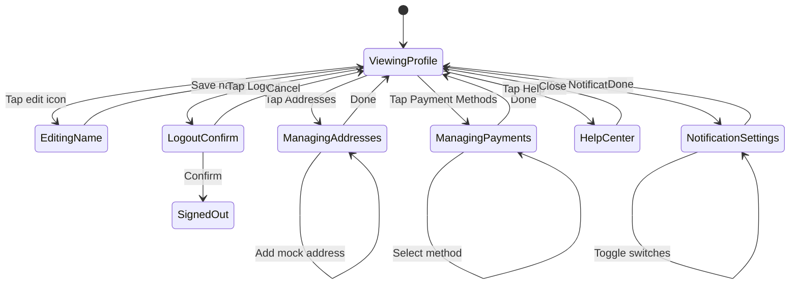

## Coupon Codes

Available mock coupon codes:

| Code | Effect |
| --- | --- |
| `NIGHT20` | Rs 120 off |
| `BOWLUP` | Rs 90 off |
| `DRIP40` | Rs 75 off |

Users can either tap coupon cards or type the code manually in the cart.

## Payment Flow

The payment page is a mock gateway UI. It does not call a real payment provider. It supports:

- UPI method card
- Credit / debit card method card
- Neon Wallet method card
- Secure checkout header
- Order summary
- Animated authorization progress
- Automatic transition to tracking after mock authorization

## Project Structure

```text
app/src/main/java/com/neon/zomato/
|-- data/
|   |-- local/
|   |   |-- LocalStorage.kt
|   |   |-- MockAssetReader.kt
|   |-- model/
|   |   |-- DtoModels.kt
|   |   |-- Mappers.kt
|   |-- remote/
|   |   |-- FoodApi.kt
|   |-- repository/
|       |-- MockFoodRepository.kt
|-- domain/
|   |-- model/
|   |   |-- Models.kt
|   |-- repository/
|   |   |-- FoodRepository.kt
|   |-- usecase/
|       |-- FoodUseCases.kt
|-- presentation/
|   |-- ui/
|   |   |-- components/
|   |   |   |-- NeonComponents.kt
|   |   |-- screens/
|   |   |   |-- auth/
|   |   |   |-- cart/
|   |   |   |-- detail/
|   |   |   |-- home/
|   |   |   |-- offers/
|   |   |   |-- onboarding/
|   |   |   |-- orders/
|   |   |   |-- payment/
|   |   |   |-- profile/
|   |   |   |-- search/
|   |   |   |-- splash/
|   |   |   |-- tracking/
|   |   |-- theme/
|   |       |-- Color.kt
|   |       |-- Shape.kt
|   |       |-- Theme.kt
|   |       |-- Type.kt
|   |-- viewmodel/
|       |-- AppViewModels.kt
|-- di/
|   |-- AppModule.kt
|-- navigation/
|   |-- NavGraph.kt
|-- MainActivity.kt
|-- NeonZomatoApp.kt
```

## Screens

| Screen | File | Description |
| --- | --- | --- |
| Splash | `screens/splash/SplashScreen.kt` | Lottie-backed intro with spring logo feel. |
| Onboarding | `screens/onboarding/OnboardingScreen.kt` | Three-slide pager with full-bleed images and CTA. |
| Auth | `screens/auth/AuthScreen.kt` | Mock OTP login and Google sign-in UI. |
| Home | `screens/home/HomeScreen.kt` | Location bar, search, intel strip, filters, offers, categories, restaurants, trending, order again. |
| Search | `screens/search/SearchScreen.kt` | Live filtering, recent search delete, shimmer state, compact cards. |
| Detail | `screens/detail/RestaurantDetailScreen.kt` | Hero image, sticky tabs, menu cards, morphing quantity buttons. |
| Cart | `screens/cart/CartScreen.kt` | Swipe delete, undo snackbar, coupon cards, manual coupon entry, animated price summary. |
| Payment | `screens/payment/PaymentScreen.kt` | Mock gateway, method selection, secure checkout, authorization progress. |
| Tracking | `screens/tracking/OrderTrackingScreen.kt` | Google Map, route, rider marker, timeline progress, accessible map controls. |
| Orders | `screens/orders/OrdersScreen.kt` | Active / Past tabs and empty state. |
| Offers | `screens/offers/OffersScreen.kt` | Masonry-style offer cards with swipe unlock. |
| Profile | `screens/profile/ProfileScreen.kt` | Profile stats, animated avatar ring, menu, theme toggle. |

## Architecture

The app follows a practical clean architecture layout:

- Data layer owns Room, Retrofit scaffolding, local mock data, DTOs, and repository implementation.
- Domain layer owns app models, repository contracts, and use cases.
- Presentation layer owns Compose UI and ViewModels.
- DI layer wires implementations to interfaces.
- Navigation layer owns route definitions and screen transitions.

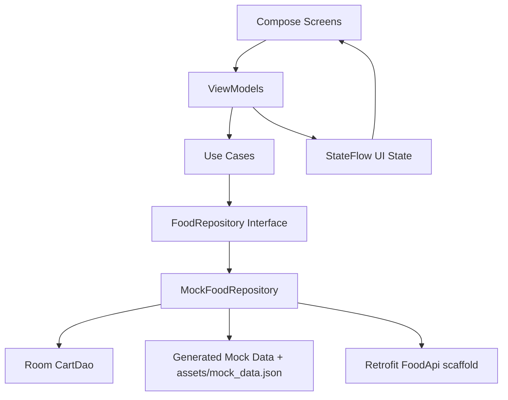

## Route Graph

The app uses one Compose Navigation graph. Bottom navigation owns the main tabs, while cart, payment, detail, and tracking are pushed as flow screens.

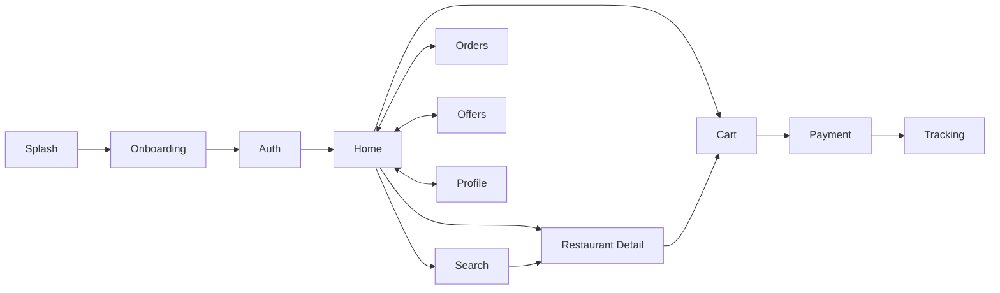

## Module Responsibility Diagram

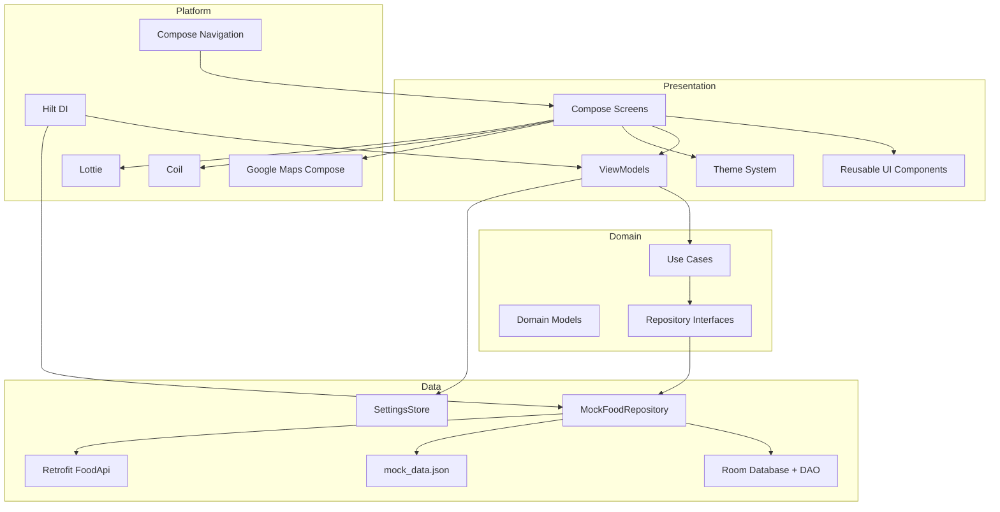

## Control And Data Flow

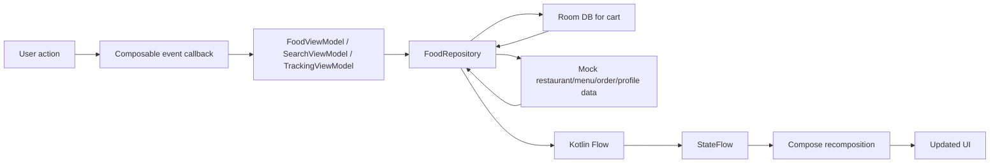

## State Ownership

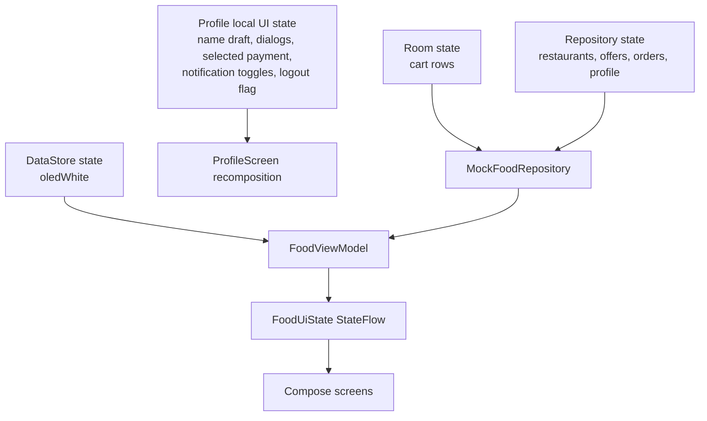

## Main User Sequence

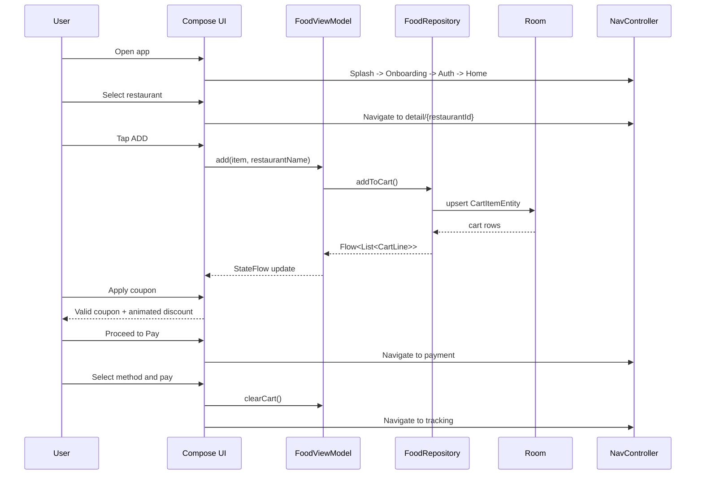

## Profile Settings Sequence

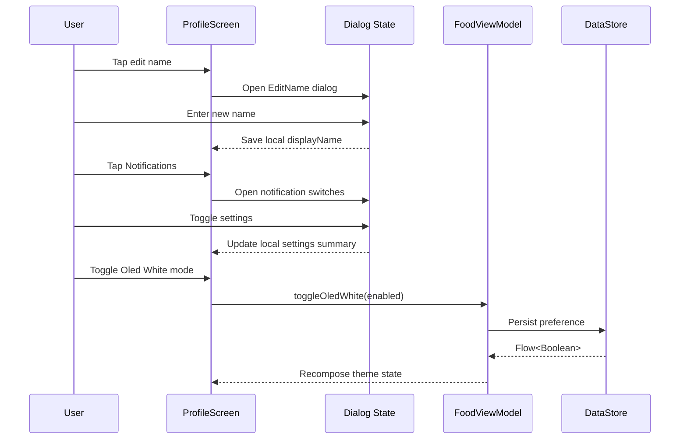

## Payment And Tracking Sequence

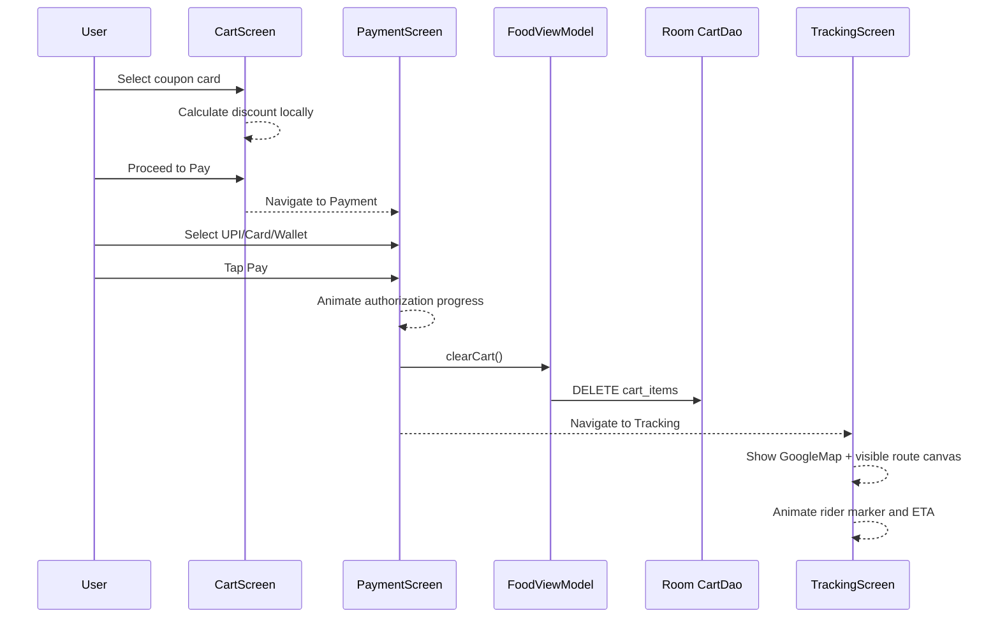

## Computation Diagram

Cart and payment totals are calculated locally from `CartLine` values.

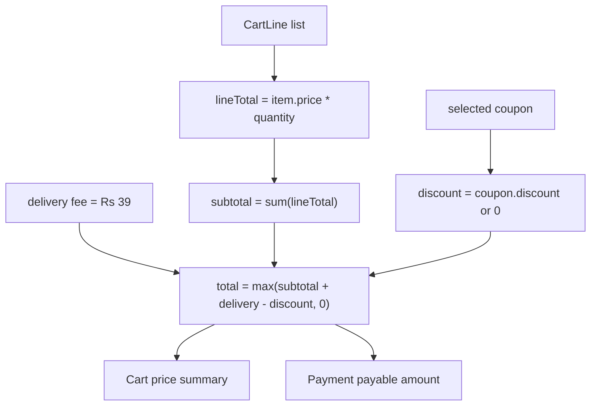

## Storage Schema

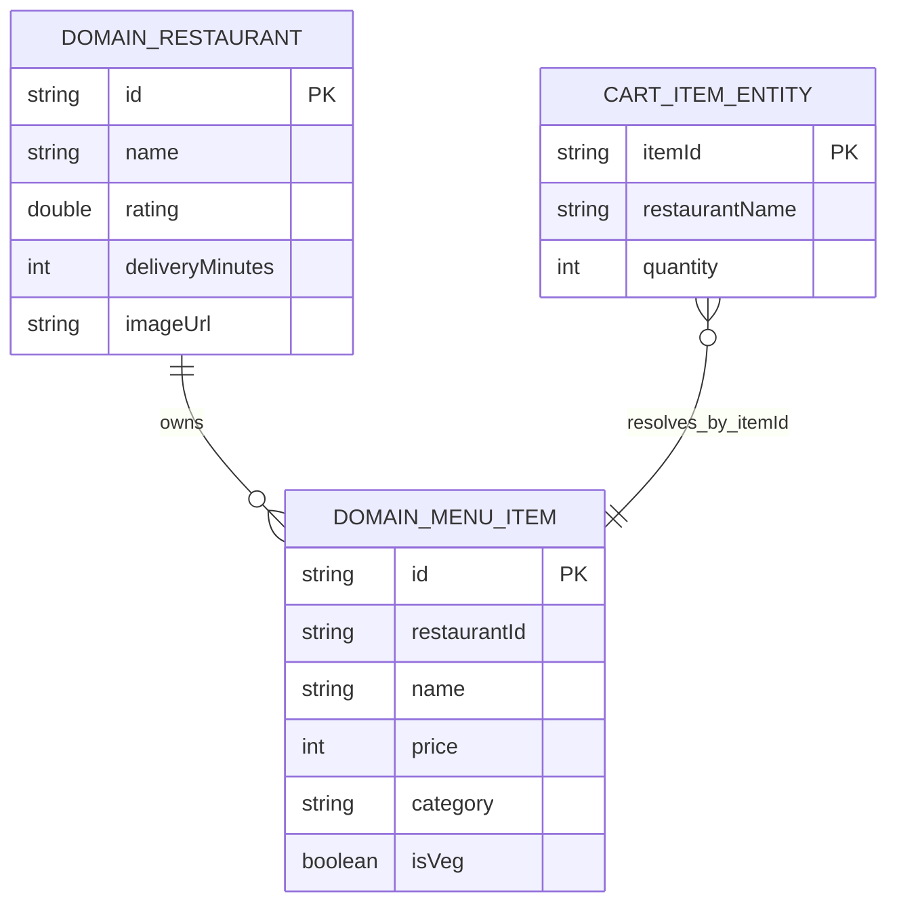

## Order Tracking Computation

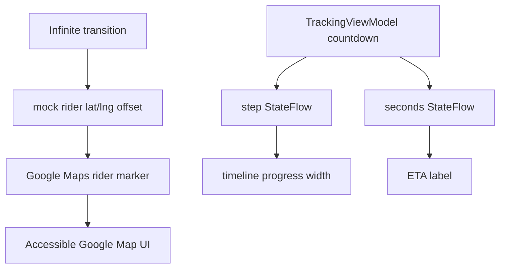

## Visible Route Map Computation

The route map fallback is drawn with Compose Canvas. It is intentionally visible even when the Google tile layer is unavailable.

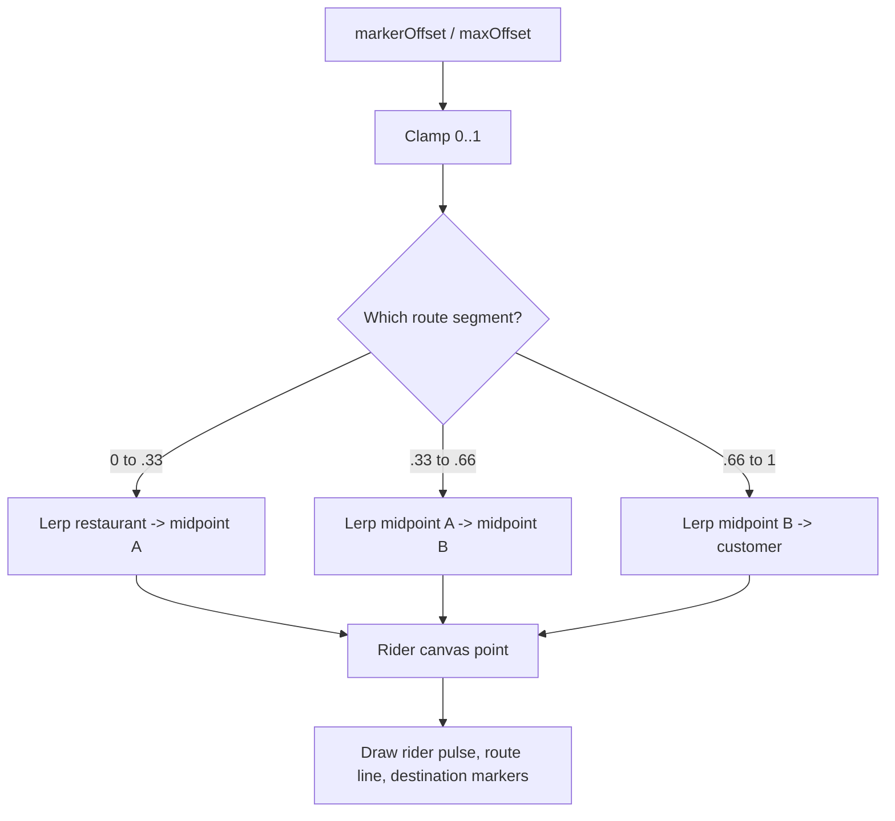

## Dependency Injection

Hilt setup:

- `NeonZomatoApp` is annotated with `@HiltAndroidApp`.
- `MainActivity` is annotated with `@AndroidEntryPoint`.
- `AppModule` provides:
  - `NeonDatabase`
  - `CartDao`
  - `SettingsStore`
  - `OkHttpClient`
  - `Retrofit`
  - `FoodApi`
- `RepositoryModule` binds:
  - `FoodRepository` to `MockFoodRepository`

## Data Storage

Room stores cart rows:

```kotlin
CartItemEntity(
    itemId: String,
    restaurantName: String,
    quantity: Int
)
```

The repository maps `itemId` back to full menu item details from the generated mock restaurants. This keeps DB rows small while preserving rich UI data.

DataStore stores:

```text
oled_white: Boolean
```

This drives the Profile screen Oled White mode toggle.

## Mock Data

The repository generates:

- 20 restaurants
- 10 menu items per restaurant
- 5 offer banners
- 3 past orders
- 8 food categories
- 1 user profile

There is also a reference JSON asset at:

```text
app/src/main/assets/mock_data.json
```

## Build Files

Root Gradle:

```text
build.gradle
settings.gradle
gradle.properties
```

App Gradle:

```text
app/build.gradle
```

Pinned versions:

- Android Gradle Plugin: `7.3.1`
- Kotlin: `1.7.20`
- Compose compiler: `1.3.2`
- Compose UI: `1.3.3`
- Material 3: `1.0.1`
- Hilt: `2.44`
- Room: `2.4.3`
- Navigation Compose: `2.5.3`
- Coil Compose: `2.2.2`
- Lottie Compose: `5.2.0`
- Google Maps Compose: `2.7.2`

## Important Notes

- The payment gateway is mock UI only. It does not process real money.
- OTP and Google sign-in are mock UI only.
- Retrofit is included and configured, but the app currently uses local mock data.
- Google Maps requires a real API key for production map tiles.
- The app is intentionally Compose-only; XML resources are limited to manifest theme styles, string resources, and launcher vector drawables.
